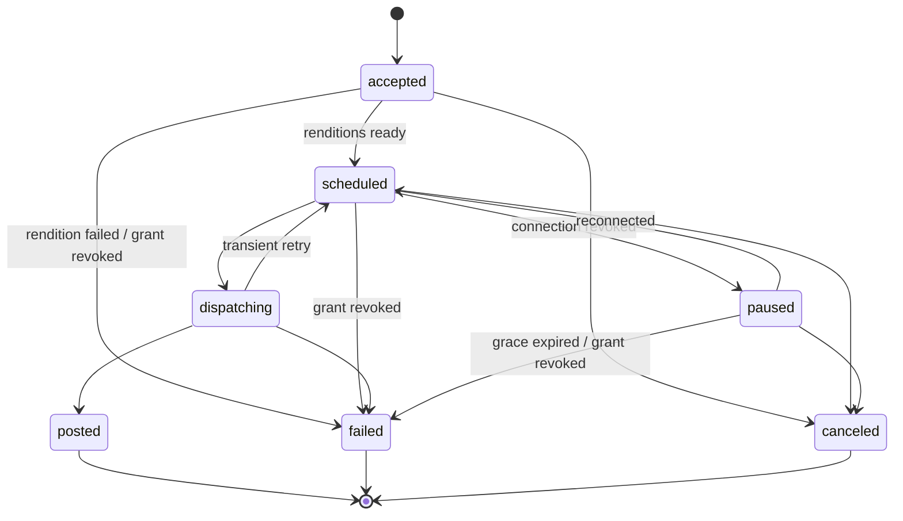

# Social Poster — Internal API Contract (v1.1)

*Creator Suite · v1.1 2026-09-26 (v1 2026-09-19). Repo copy; this file is now the source of truth for implementation. The machine-readable form lives in `packages/poster-contract` (zod → OpenAPI, DECISIONS D-026), and the two must agree.*

**v1.1 changes, all additive and non-breaking under §10:**
- §2: second auth mode (user mode) for browser clients (D-023).
- §3: revoking a grant fails that app's undispatched targets (`grant_revoked`).
- §5: cancel also works on `paused` targets.
- §6: added transitions `accepted→failed`, `scheduled→failed`, `paused→canceled`. `accepted` is now defined as awaiting media renditions (D-016). Crash semantics made explicit (D-012).
- §8: new `reason_class` values `grant_revoked`, `rendition_failed`, `dispatch_outcome_unknown` (D-015).
- §10: grace-window default is now in the schema; the contract-as-code rule is added.

## 1. Purpose & principles

This contract is the service-to-service interface between the Social Poster and its API clients. The Podcast Clipper (built second) and the Trainer (promotion, its milestone M4) consume it exactly as an external API customer would — there is no privileged internal path. The Poster is built against this contract first; later apps target it without renegotiation.

Principles:

- Connections belong to the **user**, not to any app. One TikTok connection serves every authorized app.
- Tokens never cross this boundary. Apps hold grants (scopes), never credentials.
- Submission is idempotent; delivery is asynchronous. Clients learn outcomes via webhooks, not polling.
- Rejections are machine-readable. A client can programmatically distinguish "caption too long for X" from "connection revoked".
- Additive evolution. Clients must ignore unknown fields and event types.

## 2. Authentication

The API has **two auth modes on the same `/v1` routes**. Handlers are shared, so every client, first-party or not, sees identical behavior (D-023).

### 2.1 App mode (services)

Each client app receives a `client_id` and `client_secret` at registration (stored in the secrets manager, never in app databases). Requests authenticate with a short-lived bearer token from a client-credentials exchange:

```
POST /v1/oauth/token
  grant_type=client_credentials&client_id=...&client_secret=...
→ { "access_token": "<jwt, 15 min>", "token_type": "Bearer" }
```

- Tokens are scoped to the app; the JWT `sub` claim identifies the app on every request.
- Per-app rate limits; 429 with `Retry-After` on breach.
- All traffic over TLS. Acting on behalf of a user requires that user's grant (section 3) — app credentials alone never authorize publishing.

### 2.2 User mode (browsers)

Browser clients can't hold a client secret. The Poster's own UI (`poster-web`) calls the API with the signed-in user's Supabase session JWT:

```
Authorization: Bearer <supabase session jwt>
```

- The request acts as the first-party app `poster-web`. `user_id` in paths and bodies must equal the token's `sub`; otherwise the result is `403 forbidden_user`.
- The user implicitly holds full scopes on their own connections through `poster-web`, so no consent step is needed for your own composer.
- Other suite UIs (clipper-web, trainer-web) do **not** use user mode against the Poster. They call their own backend, which calls the Poster in app mode.
- CORS is allow-listed per origin.

## 3. Scope request & consent flow

An app gains publishing access to a user's connections through a Poster-owned consent screen (PRD FR-04). The app never sees tokens — the outcome is a **grant**: (app, user, connection, scopes).

1. App requests scopes:

```
POST /v1/scope-requests
{ "user_id": "u_123", "platforms": ["tiktok", "youtube"],
  "scopes": ["post:publish"], "redirect_uri": "https://trainer.app/promo/callback" }
→ { "request_id": "sr_456", "consent_url": "https://poster.app/consent/sr_456" }
```

2. App sends the user to `consent_url`; the user approves or denies per connection on the Poster's screen.
3. Poster redirects to `redirect_uri` and emits a `grant.updated` webhook with the resulting grant state.

Grants are durable until the user revokes them (per app, per connection, in Poster settings — revocation also emits `grant.updated`). Revoking a grant immediately fails that app's targets on that connection that haven't dispatched yet (`accepted`, `scheduled`, `paused`), with `reason_class: grant_revoked`. Submitting a post against a connection without a covering grant returns `403 grant_missing`.

## 4. Connections API

Apps discover what they can publish to — connection health drives UI states like "reconnect TikTok to schedule these clips".

```
GET /v1/users/{user_id}/connections
→ { "connections": [
     { "connection_id": "cn_789", "platform": "tiktok",
       "handle": "@billbuilds", "status": "active",
       "granted_scopes": ["post:publish"] },
     { "connection_id": "cn_790", "platform": "youtube",
       "handle": "Bill Builds", "status": "revoked",
       "granted_scopes": [] } ] }
```

- `status`: `active` | `expiring` | `revoked` (PRD FR-01). `expiring` means refresh is failing but not yet dead — treat as a warning.
- `granted_scopes` is relative to the **calling app**: two apps see different scope lists for the same connection.
- Connection state changes arrive as `connection.revoked` / `connection.restored` webhooks; poll only as fallback.

## 5. Post submission

One **logical post** fans out to one or more targets (connection + per-platform overrides), per PRD FR-05. Media is uploaded first, referenced by id.

```
POST /v1/media   (or request a signed upload URL for large video)
→ { "media_id": "md_001", "kind": "video", "duration_s": 58 }

POST /v1/posts
Idempotency-Key: trainer-lesson-42-clip-3
{ "user_id": "u_123",
  "external_ref": "lesson_42/clip_3",
  "content": { "text": "Default caption", "media": ["md_001"] },
  "targets": [
    { "connection_id": "cn_789",
      "overrides": { "text": "TikTok-flavored caption #shorts" } },
    { "connection_id": "cn_790",
      "overrides": { "title": "Lesson 42 highlight" } } ],
  "schedule_at": "2026-09-21T14:00:00Z" }
→ 202 { "post_id": "po_555", "state": "accepted",
        "targets": [ { "target_id": "tg_1", ... }, { "target_id": "tg_2", ... } ] }
```

- **Idempotency-Key** (FR-14): retries with the same key return the original result; the same key with a *different* body is `409 idempotency_conflict`. Keys are scoped per app and retained ≥ 24 h.
- Constraint validation runs at submission (FR-06): any target failing platform rules rejects the whole request with per-target reasons (section 8). Nothing is partially accepted.
- `external_ref` is the client's own id, echoed on every webhook — the Trainer maps events back to lessons without a lookup table.
- Omitted `schedule_at` means dispatch immediately. `POST /v1/posts/{id}/cancel` works until dispatch begins (targets in `accepted`, `scheduled`, or `paused`); `PATCH` before dispatch re-validates constraints (FR-13).
- Threads (FR-08): `content.thread` as an ordered array on platforms that support it; validation rejects it elsewhere.

## 6. Post lifecycle & states

State lives **per target** — a post to TikTok and YouTube can succeed on one and fail on the other. The logical post's state is derived (posted when all targets posted, `partial` when mixed).



`accepted` means the target is waiting for per-platform media renditions. Targets that need no transcode go straight to `scheduled`, so clients may never observe `accepted`.

Once `dispatching` begins, cancel is refused (`409 too_late`). `posted` carries the platform permalink; `failed` carries a reason class (section 8).

**Exactly-once dispatch** per target is enforced at the database claim (NFR-02): clients never see a double-post. A target in `dispatching` is never automatically re-sent. If a worker dies mid-call, the Poster asks the platform whether the attempt landed. If it did, the target becomes `posted`; if it provably didn't, the target retries; and if the outcome can't be determined, the target fails with `dispatch_outcome_unknown`. Clients may resubmit such a target after checking the account themselves. A rare visible failure is preferable to a silent duplicate.

## 7. Lifecycle webhooks

Delivery is **at-least-once**, ordering not guaranteed — consumers deduplicate on `event_id` and treat the `state` field as authoritative, not event arrival order. Retries with exponential backoff for up to 24 h on non-2xx.

| Event | When | Notable payload fields |
| --- | --- | --- |
| `post.scheduled` | Validation passed, queued | `schedule_at` |
| `post.posted` | Platform confirmed | `permalink`, `platform_post_id` |
| `post.failed` | Permanent failure | `reason_class`, `platform_message` |
| `post.paused` | Connection revoked mid-queue | `connection_id` |
| `post.resumed` | Reconnect restored the queue | — |
| `grant.updated` | Consent granted or revoked | full grant state |
| `connection.revoked` / `connection.restored` | Vault refresh outcome | `connection_id`, `platform` |

Payload shape:

```
POST {app_webhook_url}
X-Poster-Signature: t=1758290400,v1=<hmac-sha256 of t + "." + body>
{ "event_id": "ev_991", "type": "post.posted",
  "occurred_at": "2026-09-21T14:00:07Z",
  "post_id": "po_555", "target_id": "tg_1",
  "external_ref": "lesson_42/clip_3", "state": "posted",
  "data": { "permalink": "https://tiktok.com/@billbuilds/video/123" } }
```

Signatures use a per-app webhook secret; reject if the timestamp is older than 5 minutes (replay window).

## 8. Errors & constraint rejections

One envelope everywhere; `details` is per-target so a client can fix exactly the failing platform (FR-06).

```
422
{ "error": { "code": "constraint_violation",
    "message": "1 of 2 targets failed validation",
    "details": [
      { "target_index": 0, "connection_id": "cn_789",
        "code": "video_too_long",
        "constraint": { "max_duration_s": 600, "actual_s": 745 } } ] } }
```

| HTTP | Code | Meaning |
| --- | --- | --- |
| 401 | `invalid_token` | App or user token expired or bad |
| 403 | `forbidden_user` | User-mode token doesn't match the `user_id` in the request |
| 403 | `grant_missing` | No user grant covering that connection/scope |
| 409 | `idempotency_conflict` | Same key, different body |
| 409 | `too_late` | Cancel/edit after dispatch began |
| 422 | `constraint_violation` | Platform rules failed; see `details` |
| 429 | `rate_limited` | Per-app limit; honor `Retry-After` |

Constraint codes (extensible; clients ignore unknown ones): `text_too_long`, `video_too_long`, `media_unsupported_format`, `aspect_ratio_invalid`, `thread_not_supported`, `too_many_media`. Runtime failures use `reason_class` on `post.failed` (extensible; clients handle unknown values as generic failure):

| `reason_class` | Meaning | Client action |
| --- | --- | --- |
| `transient_exhausted` | Retries ran out on temporary errors | Resubmit later |
| `platform_rejected` | Platform refused the content; see `platform_message` | Fix content, resubmit |
| `token_revoked_expired` | Connection revoked and grace window passed | Prompt reconnect, resubmit |
| `grant_revoked` *(v1.1)* | User revoked this app's grant | Re-request scopes |
| `rendition_failed` *(v1.1)* | Media couldn't be transcoded for this platform | Check media, resubmit |
| `dispatch_outcome_unknown` *(v1.1)* | Worker crashed mid-send and the platform can't confirm either way | Check the account before resubmitting |

## 9. Token revocation & pause semantics

When a refresh fails or a platform revokes access (FR-03), scheduled posts **pause rather than fail** — the user's fix (reconnect) should rescue the queue.

1. Vault marks the connection `revoked`; emits `connection.revoked`.
2. Every scheduled target on that connection moves to `paused`; one `post.paused` per target.
3. The Poster notifies the user; client apps may deep-link into the reconnect flow via a fresh `consent_url`.
4. On reconnect: targets whose `schedule_at` is still in the future return to `scheduled` and emit `post.resumed`.
5. Targets already past due dispatch immediately if within the **grace window — proposed 60 minutes** — otherwise they fail with `token_revoked_expired`. A stale "9 AM Monday" post going out Thursday is worse than a failure the app can resubmit.

## 10. Versioning & open items

Path versioning (`/v1`). **Contract as code:** every change starts in `packages/poster-contract` (zod schemas), which generates the OpenAPI spec and the typed client, and a CI test validates live responses against the spec (D-026). Update this document in the same commit. Additive changes — new optional fields, new event types, new constraint codes — are non-breaking; clients must tolerate them. Breaking changes ship as `/v2` with an overlap period. Webhook payloads follow the same rule.

Open items to settle before the Trainer integration (M4):

- [ ] **Billing boundary (OQ-3):** does Trainer promotion count against a creator's Poster plan or bundle into the Trainer subscription? Leaning bundled, with usage attributed internally per FR-15 — confirm before pricing pages exist.
- [ ] **Grace window:** 60 minutes, implemented as the default in `poster.resume_connection_targets` and `poster.expire_paused_targets`; validate against real reconnect behavior in M2.
- [ ] **Aggregator choice (OQ-1):** constrains the constraint engine's media specs (e.g., max video length per platform) but not this contract's shape. Publish the concrete limits as data (`GET /v1/platforms/constraints`) so clients never hard-code them.
- [ ] **Media upload path for large video:** direct signed-URL upload vs. proxy through the API — decide before Clipper volume arrives.
