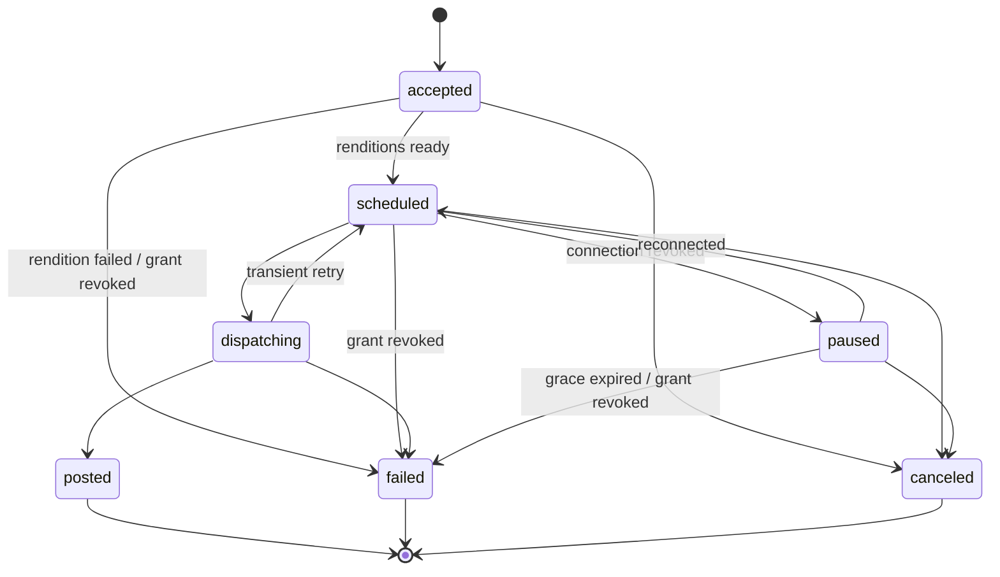

# Social Poster — Internal API Contract (v1.5)

*Creator Suite · v1.5 2026-09-26 (v1.4, v1.3, v1.2, v1.1 all 2026-09-26; v1 2026-09-19). Repo copy; this file is now the source of truth for implementation. The machine-readable form lives in `packages/poster-contract` (zod → OpenAPI, DECISIONS D-026), and the two must agree.*

**v1.5 changes, all additive and non-breaking under §10:**
- §7: every event type now has a zod payload schema, and the signature rules are stated precisely (raw bytes, replay window, unknown types tolerated).
- §7: `grant.updated` carries `grant_id` as a prefixed `gr_` id rather than a raw uuid; `gr_` is registered in §8's prefix list (D-078).
- §8: `gr_` added to the public id prefixes.

**v1.4 changes, all additive and non-breaking under §10:**
- §5: `POST /v1/media` specified with both upload paths, plus `POST /v1/media/{id}/complete` (D-061).
- §5.3: `GET /v1/posts/{id}`, `PATCH /v1/posts/{id}` and `POST /v1/posts/{id}/cancel` specified, including the mixed-state cancel rule (D-068).
- §8: new constraint code `media_not_ready` for a referenced upload that has not finished.

**v1.3 changes, all additive and non-breaking under §10:**
- §5.1: `GET /v1/platforms/constraints` specified — the published limits, with provenance and a `provisional` flag (D-058).
- §5.2: `POST /v1/posts/validate` added — the same checks as submission, without creating anything (D-057).
- §8: new constraint codes `media_required` and `text_invalid_characters` (D-056). Clients ignore unknown constraint codes, so this is additive.

**v1.2 changes, all additive and non-breaking under §10:**
- §2: `expires_in` on the token response, and a new `GET /v1/auth/context` endpoint reporting the acting app and user (D-048).
- §8: every error envelope now carries `request_id`, echoed in the `X-Request-Id` response header (D-044). Added codes `invalid_request` (400), `not_found` (404) and `internal_error` (500), which were already in use as HTTP statuses but unnamed.
- §8: public IDs are Crockford base32 of the resource UUID, 26 characters after the prefix (D-043).

**v1.1 changes, all additive and non-breaking under §10:**
- §2: second auth mode (user mode) for browser clients (D-023).
- §3: revoking a grant fails that app's undispatched targets (`grant_revoked`).
- §5: cancel also works on `paused` targets.
- §6: added transitions `accepted→failed`, `scheduled→failed`, `paused→canceled`. `accepted` is now defined as awaiting media renditions (D-016). Crash semantics made explicit (D-012).
- §8: new `reason_class` values `grant_revoked`, `rendition_failed`, `dispatch_outcome_unknown` (D-015).
- §10: grace-window default is now in the schema; the contract-as-code rule is added.

## 1. Purpose & principles

This contract is the service-to-service interface between the Social Poster and its API clients. The Podcast Clipper (built second) and the Trainer (promotion, its milestone M4) consume it exactly as an external API customer would — there is no privileged internal path. The Poster is built against this contract first; later apps target it without renegotiation.

Principles:

- Connections belong to the **user**, not to any app. One TikTok connection serves every authorized app.
- Tokens never cross this boundary. Apps hold grants (scopes), never credentials.
- Submission is idempotent; delivery is asynchronous. Clients learn outcomes via webhooks, not polling.
- Rejections are machine-readable. A client can programmatically distinguish "caption too long for X" from "connection revoked".
- Additive evolution. Clients must ignore unknown fields and event types.

## 2. Authentication

The API has **two auth modes on the same `/v1` routes**. Handlers are shared, so every client, first-party or not, sees identical behavior (D-023).

### 2.1 App mode (services)

Each client app receives a `client_id` and `client_secret` at registration (stored in the secrets manager, never in app databases). Requests authenticate with a short-lived bearer token from a client-credentials exchange:

```
POST /v1/oauth/token          (application/x-www-form-urlencoded)
  grant_type=client_credentials&client_id=...&client_secret=...
→ { "access_token": "<jwt>", "token_type": "Bearer", "expires_in": 900 }
```

- Tokens are scoped to the app; the JWT `sub` claim identifies the app on every request.
- Per-app rate limits; 429 with `Retry-After` on breach. The token endpoint has its own limit per `client_id` and client IP, because it is the only unauthenticated route.
- An unknown `client_id`, a wrong `client_secret`, and a disabled app are all `401 invalid_token` with the same message: the endpoint is not an app-enumeration oracle.
- All traffic over TLS. Acting on behalf of a user requires that user's grant (section 3) — app credentials alone never authorize publishing.

### 2.2 User mode (browsers)

Browser clients can't hold a client secret. The Poster's own UI (`poster-web`) calls the API with the signed-in user's Supabase session JWT:

```
Authorization: Bearer <supabase session jwt>
```

- The request acts as the first-party app `poster-web`. `user_id` in paths and bodies must equal the token's `sub`; otherwise the result is `403 forbidden_user`.
- The user implicitly holds full scopes on their own connections through `poster-web`, so no consent step is needed for your own composer.
- Other suite UIs (clipper-web, trainer-web) do **not** use user mode against the Poster. They call their own backend, which calls the Poster in app mode.
- CORS is allow-listed per origin. No wildcard: a user-mode request carries a real session token.

### 2.3 Checking who you are *(v1.2)*

```
GET /v1/auth/context[?user_id=...]
→ { "mode": "app" | "user",
    "app": { "client_id": "trainer-dev", "first_party": false },
    "user_id": "<uuid>" | null }
```

The response shape is identical in both modes, which makes this the cheapest way for a client to confirm its credentials and the user it is acting for without attempting real work. In user mode a supplied `user_id` must equal the token subject (`403 forbidden_user`); omit it and the subject is used.

## 3. Scope request & consent flow

An app gains publishing access to a user's connections through a Poster-owned consent screen (PRD FR-04). The app never sees tokens — the outcome is a **grant**: (app, user, connection, scopes).

1. App requests scopes:

```
POST /v1/scope-requests
{ "user_id": "u_123", "platforms": ["tiktok", "youtube"],
  "scopes": ["post:publish"], "redirect_uri": "https://trainer.app/promo/callback" }
→ { "request_id": "sr_456", "consent_url": "https://poster.app/consent/sr_456" }
```

2. App sends the user to `consent_url`; the user approves or denies per connection on the Poster's screen.
3. Poster redirects to `redirect_uri` and emits a `grant.updated` webhook with the resulting grant state.

Grants are durable until the user revokes them (per app, per connection, in Poster settings — revocation also emits `grant.updated`). Revoking a grant immediately fails that app's targets on that connection that haven't dispatched yet (`accepted`, `scheduled`, `paused`), with `reason_class: grant_revoked`. Submitting a post against a connection without a covering grant returns `403 grant_missing`.

## 4. Connections API

Apps discover what they can publish to — connection health drives UI states like "reconnect TikTok to schedule these clips".

```
GET /v1/users/{user_id}/connections
→ { "connections": [
     { "connection_id": "cn_789", "platform": "tiktok",
       "handle": "@billbuilds", "status": "active",
       "granted_scopes": ["post:publish"] },
     { "connection_id": "cn_790", "platform": "youtube",
       "handle": "Bill Builds", "status": "revoked",
       "granted_scopes": [] } ] }
```

- `status`: `active` | `expiring` | `revoked` (PRD FR-01). `expiring` means refresh is failing but not yet dead — treat as a warning.
- `granted_scopes` is relative to the **calling app**: two apps see different scope lists for the same connection.
- Connection state changes arrive as `connection.revoked` / `connection.restored` webhooks; poll only as fallback.

## 5. Post submission

One **logical post** fans out to one or more targets (connection + per-platform overrides), per PRD FR-05. Media is uploaded first, referenced by id.

```
POST /v1/media                         (multipart/form-data: user_id + file)
→ 201 { "media_id": "md_…", "status": "ready", "kind": "video",
        "mime_type": "video/mp4", "duration_s": 58, "width": 1080, "height": 1920 }

POST /v1/media                         (application/json, for large video)
  { "user_id": "…", "kind": "video", "mime_type": "video/mp4", "size_bytes": 84000000 }
→ 202 { "media_id": "md_…", "status": "pending_upload",
        "upload_url": "https://…", "expires_at": "…" }
  … PUT the bytes to upload_url …
POST /v1/media/{media_id}/complete
→ 200 { "media_id": "md_…", "status": "ready", "duration_s": 58, … }

POST /v1/posts
Idempotency-Key: trainer-lesson-42-clip-3
{ "user_id": "u_123",
  "external_ref": "lesson_42/clip_3",
  "content": { "text": "Default caption", "media": ["md_001"] },
  "targets": [
    { "connection_id": "cn_789",
      "overrides": { "text": "TikTok-flavored caption #shorts" } },
    { "connection_id": "cn_790",
      "overrides": { "title": "Lesson 42 highlight" } } ],
  "schedule_at": "2026-09-21T14:00:00Z" }
→ 202 { "post_id": "po_555", "state": "accepted",
        "targets": [ { "target_id": "tg_1", ... }, { "target_id": "tg_2", ... } ] }
```

- **Idempotency-Key** (FR-14): retries with the same key return the original result; the same key with a *different* body is `409 idempotency_conflict`. Keys are scoped per app and retained ≥ 24 h.
- Constraint validation runs at submission (FR-06): any target failing platform rules rejects the whole request with per-target reasons (section 8). Nothing is partially accepted.
- `external_ref` is the client's own id, echoed on every webhook — the Trainer maps events back to lessons without a lookup table.
- Omitted `schedule_at` means dispatch immediately. `POST /v1/posts/{id}/cancel` works until dispatch begins (targets in `accepted`, `scheduled`, or `paused`); `PATCH` before dispatch re-validates constraints (FR-13).
- Threads (FR-08): `content.thread` as an ordered array on platforms that support it; validation rejects it elsewhere. `content.media` and `content.thread` are mutually exclusive — media belongs to the part that carries it.
- **Media must be `ready`** *(v1.4)*: `duration_s`, `width` and `height` are read from the file, never taken from the client, and a post referencing a `pending_upload` item is rejected with `media_not_ready`. A successful probe is not enough on its own — a file with no readable dimensions is refused at upload.
- Omitting `schedule_at` sets each target's `due_at` to the moment of submission. Targets are created `scheduled`, not `accepted`: `accepted` is reserved for waiting on a per-platform rendition (D-016), and nothing requires one yet.

### 5.1 Platform constraints *(v1.3)*

```
GET /v1/platforms/constraints
→ { "platforms": [
      { "platform_id": "tiktok", "display_name": "TikTok",
        "supports_threads": false, "spec_version": 1,
        "updated_at": "2026-09-26T00:00:00Z",
        "spec": {
          "text":  { "max_length": 2200, "unit": "utf16_code_units" },
          "media": { "kinds": ["video"], "mime_types": ["video/mp4", …],
                     "min_count": 1, "max_count": 1 },
          "video": { "max_duration_s": 600, "max_duration_is_per_account": true },
          "threads": { "supported": false },
          "provisional": true,
          "sources": [ { "url": "…", "retrieved": "2026-09-26", "note": "…" } ] } } ] }
```

Never hard-code a platform rule; read it from here. Three parts of a spec matter as much as the numbers:

- **`unit`** — a length budget is meaningless without it. TikTok counts a caption in UTF-16 code units (its "runes"), a YouTube description is budgeted in UTF-8 **bytes**, and a YouTube title in characters. A caption of emoji hits the TikTok limit at half the visible characters.
- **`max_duration_is_per_account`** — when true, the value is an optimistic platform ceiling and the real limit belongs to the account. TikTok returns `max_video_post_duration_sec` per creator, and YouTube caps unverified accounts at 15 minutes. A target that passes validation may still be refused by the platform, which surfaces as `platform_rejected`.
- **`provisional`** and **`sources`** — while `provisional` is true the numbers come from platform documentation rather than the aggregator actually used to post, which is usually stricter (OQ-1). Every value cites where it came from.

Only enabled platforms appear. A platform without a published spec is not unconstrained, it is unlaunched: the API refuses to accept targets it cannot validate.

### 5.2 Validating without submitting *(v1.3)*

```
POST /v1/posts/validate
{ "user_id": "…", "content": { … }, "targets": [ { "connection_id": "cn_…" }, … ] }
→ 200 { "valid": true,
        "targets": [ { "target_index": 0, "connection_id": "cn_…", "platform_id": "tiktok" } ] }
→ 422 the §8 constraint_violation envelope
```

Runs exactly the validation `POST /v1/posts` runs and returns exactly the same 422, so a composer can show per-platform warnings before submitting instead of reimplementing the rules. Nothing is created and nothing is reserved. An unknown `connection_id` or media id is `404 not_found` rather than a validation failure — it is not a content problem, and the API does not confirm ids belonging to other users.

### 5.3 Reading, editing and cancelling *(v1.4)*

```
GET   /v1/posts/{post_id}          → 200 the post, with per-target state and outcomes
PATCH /v1/posts/{post_id}          → 200 updated, re-validated (FR-13)
POST  /v1/posts/{post_id}/cancel   → 200 { canceled_target_ids: [ … ] }
```

- `PATCH` replaces the target list wholesale when `targets` is given, and re-runs the same validation as submission. It is refused with `409 too_late` once **any** target has begun dispatching, because the content may already be on its way.
- `cancel` cancels every target that has not begun dispatching. When some targets are dispatching and others are not, the cancellable ones are cancelled and the response says which — a dispatching target genuinely cannot be recalled, and refusing the whole call would leave the others queued for no reason. `409 too_late` is returned only when **nothing** could be cancelled. Cancelling an already-cancelled post is `200` with an empty `canceled_target_ids`, so a retry is safe.
- In app mode these are scoped to the calling app's own posts. In user mode they are scoped to the user, who sees every post made on their behalf whichever app created it.

## 6. Post lifecycle & states

State lives **per target** — a post to TikTok and YouTube can succeed on one and fail on the other. The logical post's state is derived (posted when all targets posted, `partial` when mixed).



`accepted` means the target is waiting for per-platform media renditions. Targets that need no transcode go straight to `scheduled`, so clients may never observe `accepted`.

Once `dispatching` begins, cancel is refused (`409 too_late`). `posted` carries the platform permalink; `failed` carries a reason class (section 8).

**Exactly-once dispatch** per target is enforced at the database claim (NFR-02): clients never see a double-post. A target in `dispatching` is never automatically re-sent. If a worker dies mid-call, the Poster asks the platform whether the attempt landed. If it did, the target becomes `posted`; if it provably didn't, the target retries; and if the outcome can't be determined, the target fails with `dispatch_outcome_unknown`. Clients may resubmit such a target after checking the account themselves. A rare visible failure is preferable to a silent duplicate.

## 7. Lifecycle webhooks

Delivery is **at-least-once**, ordering not guaranteed — consumers deduplicate on `event_id` and treat the `state` field as authoritative, not event arrival order. Retries with exponential backoff for up to 24 h on non-2xx.

| Event | When | Notable payload fields |
| --- | --- | --- |
| `post.scheduled` | Validation passed, queued | `schedule_at` |
| `post.posted` | Platform confirmed | `permalink`, `platform_post_id` |
| `post.failed` | Permanent failure | `reason_class`, `platform_message` |
| `post.paused` | Connection revoked mid-queue | `connection_id` |
| `post.resumed` | Reconnect restored the queue | — |
| `grant.updated` | Consent granted or revoked | full grant state |
| `connection.revoked` / `connection.restored` | Vault refresh outcome | `connection_id`, `platform` |

The table has seven rows, but `connection.revoked` and `connection.restored` share one, so there are **eight type strings**. Each has a payload schema in `packages/poster-contract` *(v1.5)*.

Payload shape:

```
POST {app_webhook_url}
X-Poster-Signature: t=1758290400,v1=<hmac-sha256 of t + "." + body>
{ "event_id": "ev_991", "type": "post.posted",
  "occurred_at": "2026-09-21T14:00:07Z",
  "post_id": "po_555", "target_id": "tg_1",
  "external_ref": "lesson_42/clip_3", "state": "posted",
  "data": { "permalink": "https://tiktok.com/@billbuilds/video/123" } }
```

Every id in the body is a public prefixed id, including ids nested in `data` — `post.paused` and the `connection.*` events carry `connection_id` as `cn_…`, and `grant.updated` carries `grant_id` as `gr_…` *(v1.5)*. `user_id` stays a uuid, as it is everywhere else in the API.

**Signatures** use a per-app webhook secret, held in a secrets manager and referenced from the database, never stored there. Four rules a consumer must follow:

1. Verify the HMAC over the **raw request bytes**. Parsing and re-serialising the JSON changes the bytes and the signature will not match.
2. The signed value is `"{t}.{raw body}"` — the timestamp, a literal dot, then the body.
3. Reject a timestamp older than **5 minutes**. The signature never expires on its own, so this is the only thing standing between you and a replayed capture.
4. Tolerate event types you do not recognise (§1, §10) rather than rejecting the delivery.

A working reference consumer that does all four, plus `event_id` deduplication, ships in `tools/webhook-sink` *(v1.5)*.

## 8. Errors & constraint rejections

One envelope everywhere; `details` is per-target so a client can fix exactly the failing platform (FR-06).

Every envelope carries `request_id`, which is also returned in the `X-Request-Id` response header *(v1.2)*. If a client sends its own `X-Request-Id`, that value is used, so a caller's correlation id survives into our logs. Quote it when reporting a problem.

```
422
{ "error": { "code": "constraint_violation",
    "message": "1 of 2 targets failed validation",
    "request_id": "8f1c3d2e-4b5a-6c7d-8e9f-0a1b2c3d4e5f",
    "details": [
      { "target_index": 0, "connection_id": "cn_0123456789ABCDEFGHJKMNPQRS",
        "code": "video_too_long",
        "constraint": { "max_duration_s": 600, "actual_s": 745 } } ] } }
```

**Public IDs** *(v1.2)*: `<prefix>_<26 characters>`, where the body is Crockford base32 of the resource's UUID. Prefixes are `po_` post, `tg_` target, `cn_` connection, `md_` media, `ev_` event, `sr_` scope request, `gr_` grant *(v1.5)*. The alphabet excludes I, L, O and U and is case-insensitive on input, so an ID survives being read aloud or retyped. A malformed or unknown ID is always `404 not_found`, never a 500.

| HTTP | Code | Meaning |
| --- | --- | --- |
| 400 | `invalid_request` *(v1.2)* | Malformed body, query, or unsupported `grant_type` |
| 401 | `invalid_token` | App or user token expired or bad |
| 404 | `not_found` *(v1.2)* | No such resource, or an ID that could not be one |
| 403 | `forbidden_user` | User-mode token doesn't match the `user_id` in the request |
| 403 | `grant_missing` | No user grant covering that connection/scope |
| 409 | `idempotency_conflict` | Same key, different body |
| 409 | `too_late` | Cancel/edit after dispatch began |
| 422 | `constraint_violation` | Platform rules failed; see `details` |
| 429 | `rate_limited` | Per-app limit; honor `Retry-After` |
| 500 | `internal_error` *(v1.2)* | Unexpected failure; the message is deliberately generic |

Constraint codes (extensible; clients ignore unknown ones): `text_too_long`, `video_too_long`, `media_unsupported_format`, `aspect_ratio_invalid`, `thread_not_supported`, `too_many_media`, `media_required` *(v1.3)* — the platform cannot post without media, `text_invalid_characters` *(v1.3)* — the text contains characters the platform refuses outright, and `media_not_ready` *(v1.4)* — a referenced upload has not completed, so wait rather than change anything. One `details` entry is returned per violation, so a target that breaks two rules produces two entries with the same `target_index`. Runtime failures use `reason_class` on `post.failed` (extensible; clients handle unknown values as generic failure):

| `reason_class` | Meaning | Client action |
| --- | --- | --- |
| `transient_exhausted` | Retries ran out on temporary errors | Resubmit later |
| `platform_rejected` | Platform refused the content; see `platform_message` | Fix content, resubmit |
| `token_revoked_expired` | Connection revoked and grace window passed | Prompt reconnect, resubmit |
| `grant_revoked` *(v1.1)* | User revoked this app's grant | Re-request scopes |
| `rendition_failed` *(v1.1)* | Media couldn't be transcoded for this platform | Check media, resubmit |
| `dispatch_outcome_unknown` *(v1.1)* | Worker crashed mid-send and the platform can't confirm either way | Check the account before resubmitting |

## 9. Token revocation & pause semantics

When a refresh fails or a platform revokes access (FR-03), scheduled posts **pause rather than fail** — the user's fix (reconnect) should rescue the queue.

1. Vault marks the connection `revoked`; emits `connection.revoked`.
2. Every scheduled target on that connection moves to `paused`; one `post.paused` per target.
3. The Poster notifies the user; client apps may deep-link into the reconnect flow via a fresh `consent_url`.
4. On reconnect: targets whose `schedule_at` is still in the future return to `scheduled` and emit `post.resumed`.
5. Targets already past due dispatch immediately if within the **grace window — proposed 60 minutes** — otherwise they fail with `token_revoked_expired`. A stale "9 AM Monday" post going out Thursday is worse than a failure the app can resubmit.

## 10. Versioning & open items

Path versioning (`/v1`). **Contract as code:** every change starts in `packages/poster-contract` (zod schemas), which generates the OpenAPI spec and the typed client, and a CI test validates live responses against the spec (D-026). Update this document in the same commit. Additive changes — new optional fields, new event types, new constraint codes — are non-breaking; clients must tolerate them. Breaking changes ship as `/v2` with an overlap period. Webhook payloads follow the same rule.

Open items to settle before the Trainer integration (M4):

- [ ] **Billing boundary (OQ-3):** does Trainer promotion count against a creator's Poster plan or bundle into the Trainer subscription? Leaning bundled, with usage attributed internally per FR-15 — confirm before pricing pages exist.
- [ ] **Grace window:** 60 minutes, implemented as the default in `poster.resume_connection_targets` and `poster.expire_paused_targets`; validate against real reconnect behavior in M2.
- [ ] **Aggregator choice (OQ-1):** constrains the constraint engine's media specs (e.g., max video length per platform) but not this contract's shape. Publish the concrete limits as data (`GET /v1/platforms/constraints`) so clients never hard-code them.
- [ ] **Media upload path for large video:** direct signed-URL upload vs. proxy through the API — decide before Clipper volume arrives.
